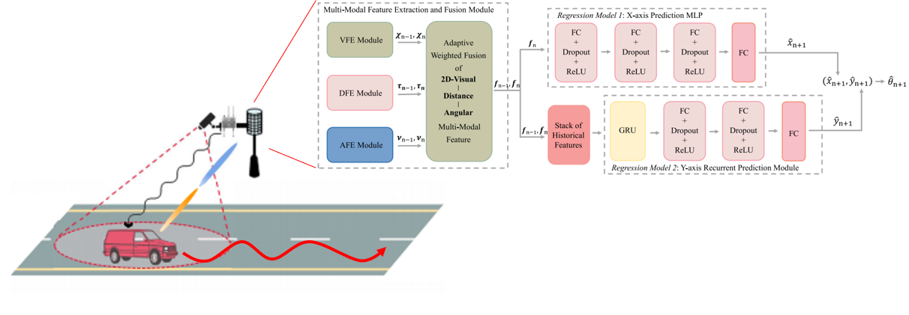
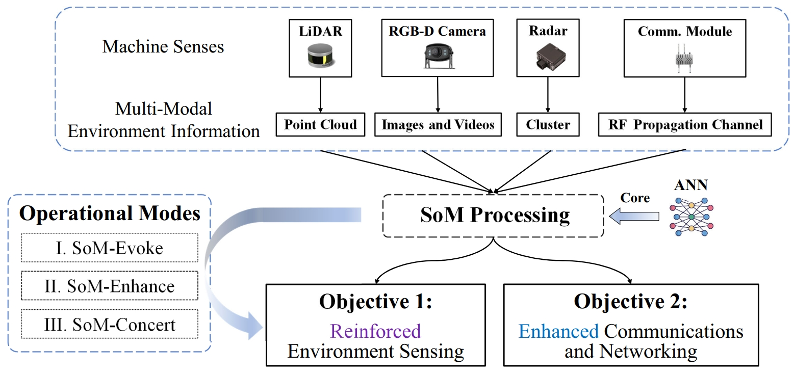
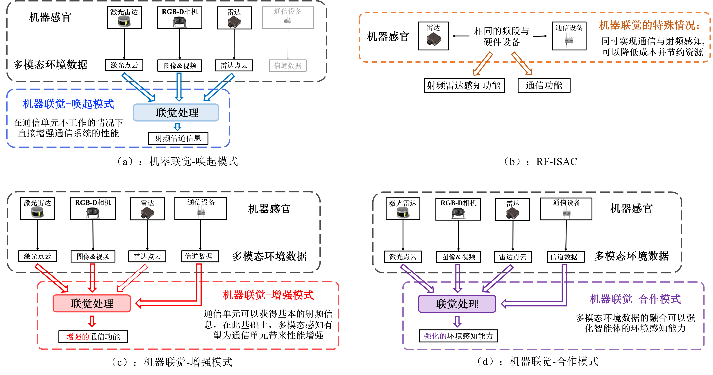
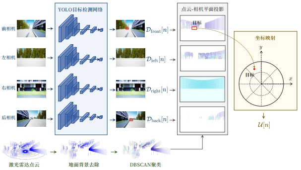
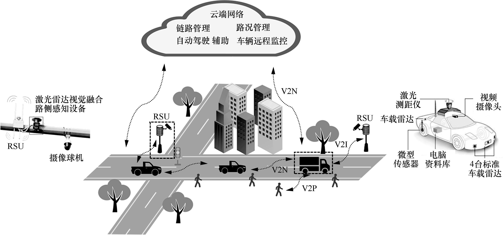
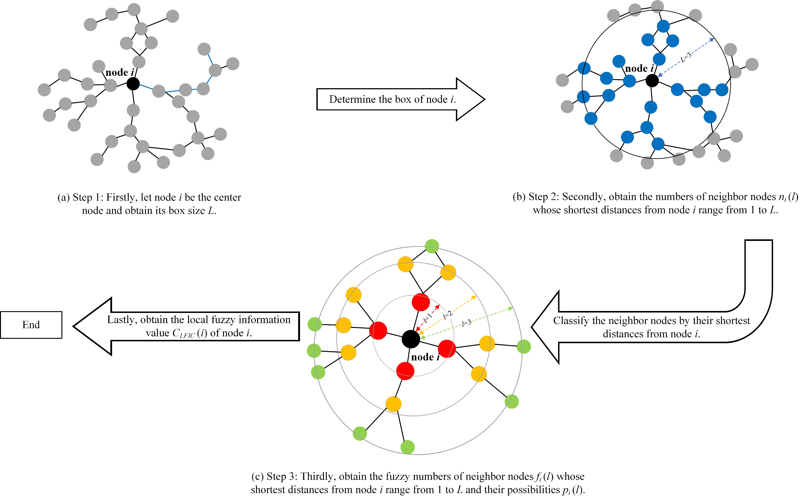
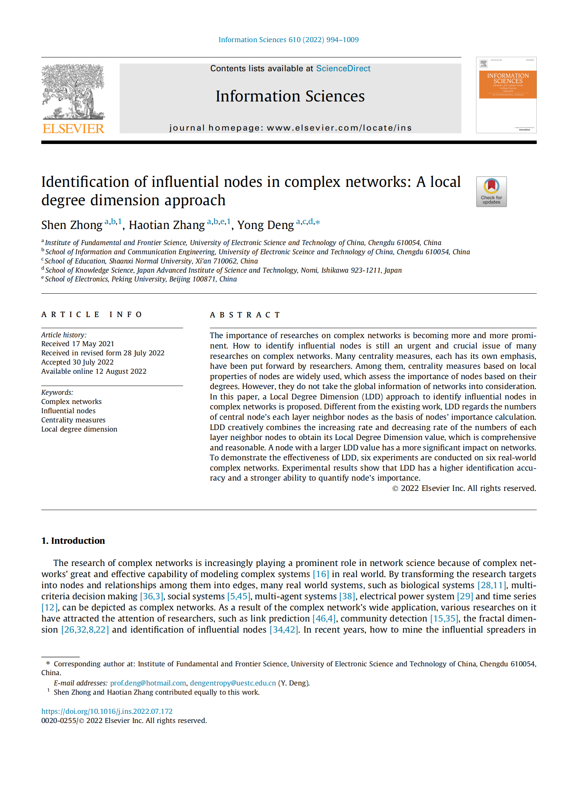

# About Me

**I'm now a Ph.D. candidate of School of Electronics, Peking University under the supervision of *[Prof. Xiang Cheng (IEEE Fellow)](http://pcni.pku.edu.cn/homepage.html)*. I am a group member of *[Pervasive Connectivity and Networked Intelligence (PCNI)](http://pcni.pku.edu.cn/homepage.html)*. My Google Scholar link is *[here](https://scholar.google.com/citations?hl=zh-CN&user=Vph0sK0AAAAJ&view_op=list_works&sortby=pubdate)*.**

# Interests

**My research interests include**

* **Multi-modal Sensing-Communication Integration Aided Transceiver Design**: Explore how to effectively utilize multi-modal sensing to assist in transceiver design, e.g., proactive beamforming, channel estimation, and precoding design.

# Education

### - Ph.D Candidate in Information and Signal Processing
#### _2022/-09-2027/06 (expected)_
  * **School of Electronics, Peking University, Beijing**

### - Bachelor of Network Engineering
#### _2018/09-2022/06_
  * **School of Information and Communication Engineering, University of Electronic Science and Technology of China (UESTC), Chengdu**

# 📝 Publications
<table border="2">
  <tr>
    <td width="75%">
      
<b>Integrated Sensing and Communications Towards Proactive Beamforming in mmWave V2I via Multi-Modal Feature Fusion (MMFF)</b>

      
<small><b>Haotian Zhang*</b>, S. Gao, X. Cheng, L. Yang </small>

      
<small><b>IEEE Transactions on Wireless Communications (SCI, JCR Q1, IF: 10.4), 2023</b></small>

      <a href="https://arxiv.org/abs/2310.02561">Paper</a>
    </td>
    <td width="25%">
      
    </td>
  </tr>
</table>

<table border="2">
  <tr>
    <td width="75%">
      
<b>Intelligent Multi-Modal Sensing-Communication Integration: Synesthesia of Machines</b>

      
<small>X. Cheng, <b>Haotian Zhang*</b>, J. Zhang, S. Gao, S. Li, Z. Huang, L. Bai, Z. Yang, X. Zheng, L. Yang </small>

      
<small><b>IEEE Communications Surveys & Tutorials (SCI, JCR Q1, IF: 35.6), 2023</b></small>

      <a href="https://ieeexplore.ieee.org/document/10330577">Paper</a>
    </td>
    <td width="25%">
      
    </td>
  </tr>
</table>

<table border="2">
  <tr>
    <td width="75%">
      
<b>机器联觉：通信与多模态感知的智能融合</b>

      
<small>X. Cheng, <b>Haotian Zhang*</b>, S. Li, Z. Huang, Z. Yang, S. Gao, L. Bai, J. Zhang, X. Zheng, L. Yang </small>

      
<small><b>模式识别与人工智能（EI）, 2023</b></small>

      <a href="http://manu46.magtech.com.cn/Jweb_prai/CN/abstract/abstract12648.shtml">Paper</a>
    </td>
    <td width="25%">
      
    </td>
  </tr>
</table>

<table border="2">
  <tr>
    <td width="75%">
      
<b>应用于毫米波车车通信的多模态感知辅助波束预测</b>

      
<small>W. Wen, <b>Haotian Zhang*</b>, S. Gao, X. Cheng, L. Yang </small>

      
<small><b>模式识别与人工智能 （EI）, 2023</b></small>

      <a href="http://manu46.magtech.com.cn/Jweb_prai/CN/abstract/abstract12650.shtml">Paper</a>
    </td>
    <td width="25%">
      
    </td>
  </tr>
</table>

<table border="2">
  <tr>
    <td width="75%">
      
<b>车联网通信感知一体化研究：现状与发展趋势</b>

      
<small>X. Cheng, <b>Haotian Zhang*</b>, Z. Yang, Z. Huang, S. Li, A. Yu </small>

      
<small><b>通信学报 （EI, CCF-T1） , 2022</b></small>

      <a href="http://www.infocomm-journal.com/txxb/CN/10.11959/j.issn.1000-436x.2022137">Paper</a>
    </td>
    <td width="25%">
      
    </td>
  </tr>
</table>

<table border="2">
  <tr>
    <td width="75%">
       
<b>LFIC: Identifying influential nodes in complex networks by local fuzzy information centrality</b>

       
<small><b>Haotian Zhang*</b>, S. Zhong, Y. Deng, KH. Cheong </small>

       
<small><b>IEEE Transactions on Fuzzy Systems (SCI, JCR Q1, IF: 11.9), 2021</b></small>

       <a href="https://ieeexplore.ieee.org/abstract/document/9537594/">Paper</a>
    </td>
    <td width="25%">
      
    </td>
  </tr>
</table>

<table border="2">
  <tr>
    <td width="75%">
      
<b>Identification of influential nodes in complex networks: A Local Degree Dimension Approach</b>

      
<small>S. Zhong, <b>Haotian Zhang*</b>, Y. Deng </small>

      
<small><b>Information Sciences (SCI, JCR Q1, IF: 8.1), 2022</b></small>

      <a href="https://www.sciencedirect.com/science/article/abs/pii/S0020025522008672">Paper</a>
    </td>
    <td width="25%">
      
    </td>
  </tr>
</table>

#### Beam Management
- [Integrated Sensing and Communications Toward Proactive Beamforming in mmWave V2I via Multi-Modal Feature Fusion (MMFF)], Rongjie Huang, Huadai Liu, Xize Cheng, **Yi Ren**, et al.
- [应用于毫米波车车通信的多模态感知辅助波束预测](http://manu46.magtech.com.cn/Jweb_prai/CN/abstract/abstract12650.shtml), Rongjie Huang, Jinglin Liu, Huadai Liu, **Yi Ren**, et al.
- [SimulSpeech: End-to-End Simultaneous Speech to Text Translation](https://www.aclweb.org/anthology/2020.acl-main.350), **Yi Ren**, et al.
- [Multilingual Neural Machine Translation with Knowledge Distillation](https://openreview.net/forum?id=S1gUsoR9YX), Xu Tan, **Yi Ren**, et al.

#### Music Generation 
- ``ACM-MM 2020`` [PopMAG: Pop Music Accompaniment Generation](https://dl.acm.org/doi/10.1145/3394171.3413721), **Yi Ren**, Jinzheng He, Xu Tan, et al.

#### Generative Model
- ``ICLR 2022`` [Pseudo Numerical Methods for Diffusion Models on Manifolds](https://openreview.net/forum?id=PlKWVd2yBkY), Luping Liu, **Yi Ren**, et al. \|  \| 

# 🎖 Honors and Awards
- *2024.10* National Scholarship (Ph.D. candidates)
- *2024.5* Peking University Presidential Scholarship for Ph.D. candidates
- *2022.6* Honours Bachelor Degrees of UESTC
- *2021.12* The Most Outstanding Students Award of UESTC Nomination
- *2021.10* WAC Lighting Scholarship 
- *2020.10* National Scholarship (Undergraduate) 

# Contact Me

**Email:** haotianzhang@stu.pku.edu.cn
